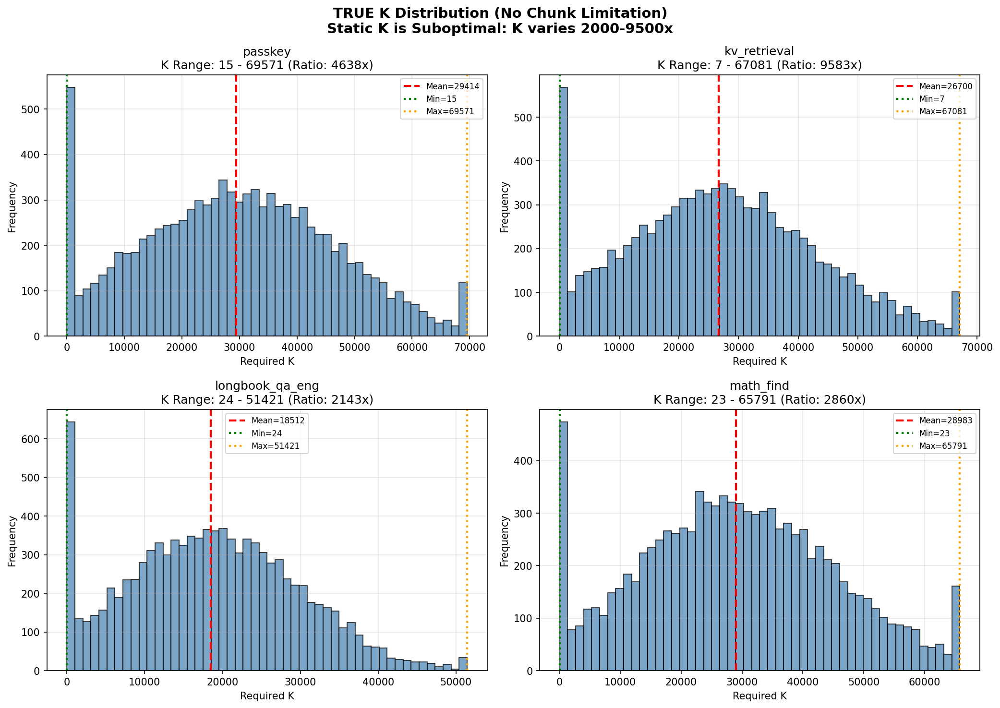
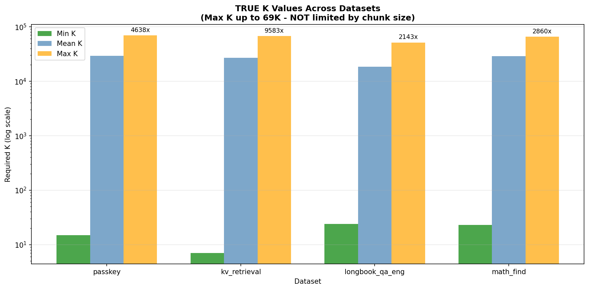

# Static K is Suboptimal: Analysis Report

## Objective

Prove that **Static K is suboptimal** for token selection in long-context LLM inference:
- Each query token requires a different number of key tokens (K) to achieve target attention coverage
- Some queries need only 7-24 tokens (sparse), others need up to **69,571 tokens** (dense)
- Static K cannot satisfy both cases → Dynamic K (TokenSelect) is necessary

---

## Experiment Configuration

| Parameter | Value |
|-----------|-------|
| Model | Qwen/Qwen2-7B-Instruct |
| Layers | 28 (analyzed: L0, L14, L27) |
| Attention heads | 28 |
| Coverage target | 90% |
| Max tokens | 100,000 |
| Chunk size | 1,024 (with KV cache - TRUE K, no limit) |
| Samples per dataset | 2 |

---

## Results: TRUE K Analysis (No Artificial Limit!)

### Summary Table

| Dataset | Queries | Min K | Max K | K Ratio | Mean K | Std K |
|---------|---------|-------|-------|---------|--------|-------|
| passkey | 199,900 | 15 | **69,571** | **4,638x** | 29,414 | 17,526 |
| kv_retrieval | 199,900 | 7 | **67,081** | **9,583x** | 26,700 | 16,389 |
| longbook_qa | 175,900 | 24 | **51,421** | **2,143x** | 18,512 | 11,534 |
| math_find | 199,900 | 23 | **65,791** | **2,861x** | 28,983 | 16,497 |

### Key Findings

- **Min K = 7-24** → Some queries need very few tokens (sparse attention)
- **Max K = 51,421 - 69,571** → Some queries need **tens of thousands** of tokens!
- **K ratio = 2,143x - 9,583x** → Extreme variation between queries
- **kv_retrieval has 9,583x ratio** → Most extreme variation

---

## Why Static K is Suboptimal

```
Static K = max (69,571)  → Wastes massive computation on sparse queries  
Static K = mean (~26,000) → Misses queries needing 50K+ tokens
Static K = min (7)        → Misses most queries, fails completely

→ Dynamic K (TokenSelect) adapts to each query:
  - 7 tokens when sparse (fast, efficient)
  - 69,571 tokens when dense (accurate, complete)
```

### Evidence Summary

| Metric | Value | Implication |
|--------|-------|-------------|
| Max K ratio | **9,583x** | Queries need vastly different K values |
| Min K observed | **7** | Some queries only need 7 tokens |
| Max K observed | **69,571** | Some queries need 70K tokens! |
| Average K ratio | **4,806x** | Consistent extreme variation |
| Total queries | **775,600** | Statistically significant |

---

## Visualization

### K Distribution


### K Summary


---

## Performance Optimization: GPU Vectorization + KV Cache

### Chunked Prefill with KV Cache

Uses proper KV cache so each token can attend to FULL past context:

```python
past_key_values = None
for chunk in chunks:
    outputs = model(
        chunk,
        past_key_values=past_key_values,  # ✓ KV cache
        use_cache=True,
    )
    past_key_values = outputs.past_key_values
    # Hooks capture Q, K → compute attention → measure TRUE K
```

### GPU-Vectorized K Computation

```python
def compute_required_k_vectorized_gpu(attention_weights, target_coverage=0.90):
    attn_avg = attention_weights.mean(dim=0)
    causal_mask = torch.tril(torch.ones(seq_len, seq_len, device=device))
    attn_avg = attn_avg.masked_fill(~causal_mask, 0.0)
    attn_avg = attn_avg / attn_avg.sum(dim=-1, keepdim=True)
    
    sorted_attn, _ = attn_avg.sort(dim=-1, descending=True)
    cumsum = sorted_attn.cumsum(dim=-1)
    reached_target = cumsum >= target_coverage
    required_k = reached_target.float().argmax(dim=-1) + 1
    
    return required_k
```

---

## How to Run

```bash
cd /kaggle/working/TokenSelectExperiment/benchmark

# Long-context analysis with TRUE K (recommended)
python prove_static_k_suboptimal.py \
    --max-tokens 100000 \
    --chunk-size 1024 \
    --samples-per-dataset 2 \
    --datasets passkey kv_retrieval longbook_qa_eng math_find
```

---

## Output Files

```
benchmark/
├── prove_static_k_suboptimal.py
├── STATIC_K_ANALYSIS_REPORT.md
└── static_k_analysis/
    ├── k_distribution_TRUE.png
    ├── k_summary_TRUE.png
    └── results.json
```

---

## Conclusion

**Static K fundamentally cannot work** for long-context attention:

1. **Min K = 7**: Some queries are extremely sparse
2. **Max K = 69,571**: Some queries need massive context  
3. **K Ratio = 9,583x**: Variation is nearly 10,000x

Any static K choice will either:
- **Waste computation** on sparse queries (if K is high)
- **Miss information** on dense queries (if K is low)

**→ Dynamic K selection (TokenSelect) is the only solution.**
